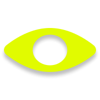

# Design Agentcy 🧑🏽‍🎨

### Generative Layouts for Design Experiments

-----

  <a href="#-overview">Overview</a> •
  <a href="#-features">Features</a> •
  <a href="#-license">License</a>

-----

Generative layouts are a powerful tool for designing experiments and prototyping. They allow designers to explore different layouts and variations, and to experiment with different design elements.

-----

## Overview

*Design Agentcy* is an exploration of generative Design. It uses [DrawBot](https://www.drawbot.com) to create programmatic layouts for designers and researchers. The project is designed to be a tool for experimentation and exploration, allowing users to generate and customize layouts based on their preferences and needs.

## Features

- **Automated layout creation**: *DrawBot* is used to generate layouts automatically, allowing users to focus on the design process rather than the technical aspects.
- **Customizable layouts**: Users can customize the layouts by adjusting parameters such as font size, text position, and orientation.
- **Save and export**: Layouts can be saved as PDF files for easy sharing and further analysis.

## License

This project is licensed under the MIT License - see the [LICENSE](LICENSE) file for details.